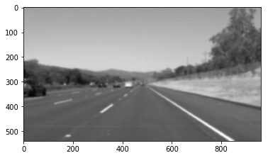
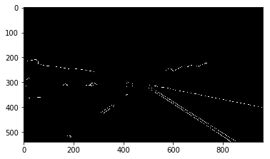
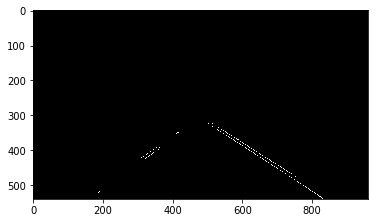
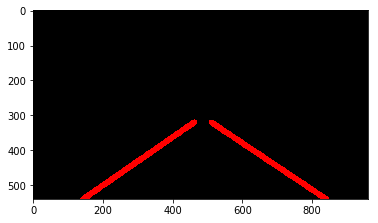
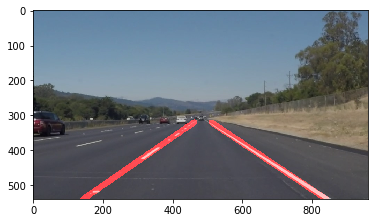

# **Finding Lane Lines on the Road** 

## Writeup Template

---

**Finding Lane Lines on the Road**

The goals / steps of this project are the following:
* Make a pipeline that finds lane lines on the road
* Reflect on your work in a written report

---

### Reflection

### 1. My pipeline for lane lines detection on the road

1. I took video input in mp4 format and passed it to moviepy.editor function VideoFileClip to read the video.
---
1. Futher passed the read video to process_image function which is self defined by me in loop till last image frame of the video is processed.
---
1. Aim of the function process_image is to take a coloured image input and return annotated image with solid right and left lane lines. This function includes 6 steps of processing an image as follows:
    1. Converte the input image to gray image using function grayscale which includes code
        ```
        gray_image = cv2.cvtColor(img,cv2.COLOR_RGB2GRAY)
        
        ```
        the output image is given below:
        
        
       ---
       
    1. Once the image is is in gray we need to remove the noises and smoothen it for better pixel strength recognization.This is achieved using openCv function GaussianBlur and kernel size decides the extent to which image should be smoothned. Kernel size should be a odd digit. I used 19 Kernel size for better results.
        ```
        cv2.GaussianBlur(img,(kernel_size,kernel_size),0)
        
        ```
        the output image is given below:
        
        ---
        
    1. After smoothning we use OpenCv function canny to detect the pixels with given strength in the image according to low and high threshold passed as parameters of the function and blackning out rest of the pixels. I used low threshold = 30 and high threshold 100 as my image is smoothned with high Kernel size and the pixel strength might be lowered as compared to its intial strength.
        ```
        cv2.Canny(img,low_threshold,high_threshold)
        
        ```
        the output image is given below:
        
        ---
        
    1. Now we have pixels of required strength in our image so we will keep pixels only in area where our lane lines are also termed as masking of image. To select area of my interest i used quadrileteral shape and tried its vertices manually. The best result came up with vertices : (160,540),(410,320),(540,320),(840,540). I used fillpoly function to mask my image
        ```
        cv2.fillPoly(mask, vertices, ignore_mask_color)
        ```
        the output mask is given below:
        
        
        ---
        
    1. As we have masked the image we only have pixels of our lane lines so we need to plot them. 
        1. To identify lines in image hough transformation is used
            ```
            cv2.HoughLinesP(img, rho, theta, threshold, np.array([]), minLineLength=min_line_length, maxLineGap=max_line_gap)
            ```
            Let's know the parameters we passed, here img is the masked image, rho=2 , theta depends on rho i.e np.pi/180, threshold is how many intersection which i took as 25, np.array is place holder, minimum length of the line is 25 and max line gap that is maximum gap allowed between two pixels for line which i chosed 1. All these parameters are selected by me by manually trying them.
        
        1. Once the lines are detected we need to detect which are the left lanes and which are the right lanes out of it so that we can average the lane lines seprately. For that i used self defined funciton left_or_right which identifies the lines by calculating slope(m) and constant(c) through numpy polyfit function. If the value of slope is positive its a right lane line if its negative its a left lane line. 
        
        1. I created to seprate lists according to left and right lines and accordingly stored m and c in them.Further Averged the list seprately using numpy average fuction. In average function axis=0 is average of each column that is average of all m's and average of all the c's.
            ```
            left_avg = np.average(left_lines,axis=0)
            right_avg = np.average(right_lines,axis=0)
            ```
     ---
     1. for drawing solid lanes:
                y1 = img.shape[0] which is 540(As the solid lanes should start from initial axis of view from car to cover the whole view of lane lines )
                x1 = y1-c/m using equation of line
                y2 = 320 (I selected this value manually after analysing the maximum values of y on various test images hence this is the maximum approx and possible view of the lane line from car view point of view in this case)
                x2 = y2-c/m using equation of line
           Both the equation for left and right will vary according to the average m and c we calculated for them.
           ```
           cv2.line(img, (calc_x(img.shape[0],left_avg[0],left_avg[1]), img.shape[0]), (calc_x(320,left_avg[0],left_avg[1]),320), color, thickness)
           ```
           the resultant image will be:
           
      ---
     1. now as we have the image with solid lane lines drawn on it we will combine it with orignal image to see the exact detection clearly. 
      ```
      cv2.addWeighted(edges, α, img, β, γ)
      ```
      
      
      this output image will be returned by the image_process function
---
1. All the output images will be again combined to form the video and will be saved using write_videofile funciton of moviepy.editor. As a result we have a fully annotated video with solid lane lines drawn on it which we identified and drawn on each image frame of the video.
---

1. Afterwards we can explicitly watch the video in our directory where we saved it our by using IPython.display library.


### 2. Identify potential shortcomings with your current pipeline


One potential shortcoming in my project is the solid lane lines are not uniform as shown in the sample output. Although my pipeline worked good with various test images but when video's image frames are combined a uniform output isn't formed. 

Diffrent light conditions may impact the detection in lane lines and this can be one shortcoming.

Another shortcoming could be it may not detect more curved lane lines.


### 3. Suggest possible improvements to your pipeline

A possible improvement would be to improvise area of selection that is masking according to right and left seprate lanes hence the average will be more accurate and so will be the output. It worked great for me when i applied it to images.But when applied in video it is unable to detect left lane lines.
These are the vertices that i used:
[(120,540),(400,310),(430,310),(200,540)],[(800,540),(580,310),(630,310),(830,540)]

Consider the one given below:


another improvement can be to improvise line detection and be able to detect curves of the lane lines by adding angles to the lines or being able to draw curves.